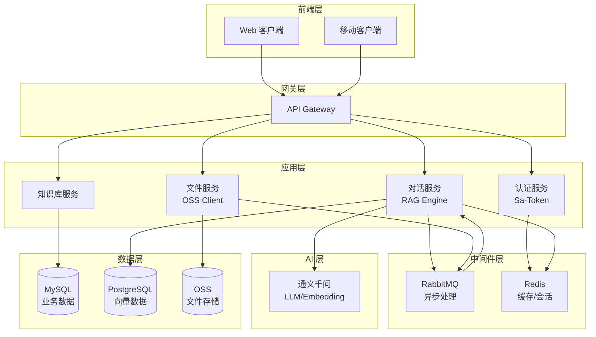
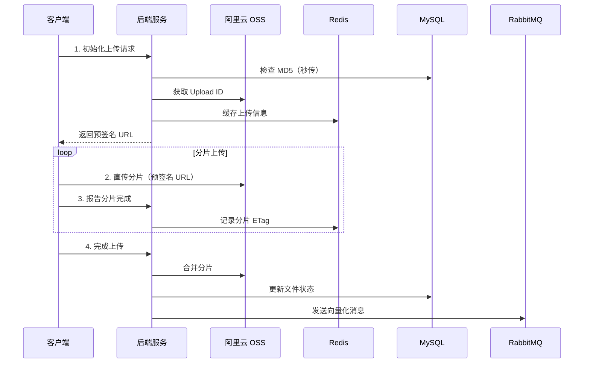
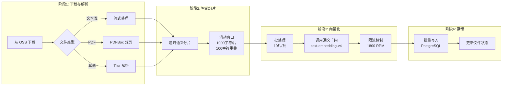
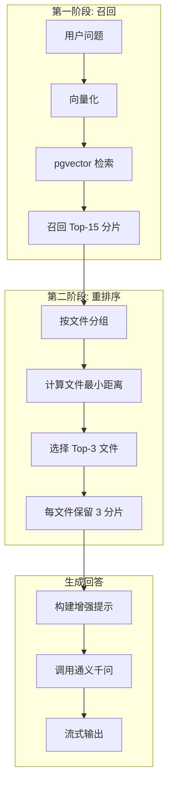
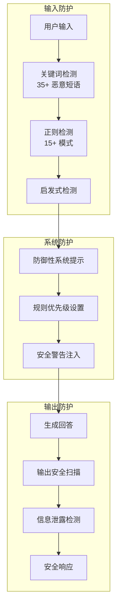

# KnowSeek - 企业级 AI 知识库管理系统

<div align="center">

[](https://spring.io/projects/spring-boot)
[](https://www.oracle.com/java/)
[](LICENSE)
[](https://www.docker.com/)
[](https://github.com/features/actions)

</div>

## 项目简介

KnowSeek 是一个企业级的 AI 知识库管理与智能问答系统，基于最新的 RAG（Retrieval-Augmented Generation）架构设计。系统集成了向量检索、文档解析、智能对话、多租户管理等核心功能，通过两阶段向量检索策略和多层安全防护机制，为企业提供安全、高效、精准的知识管理和智能问答服务。

### 🌟 核心亮点

- **企业级 RAG 架构**：两阶段检索策略（文件级 + 分片级），多文件独立标注，智能语义分片
- **多层安全防护**：提示词注入检测、防御性系统提示、输入输出双向安全检测
- **高性能文件处理**：流式处理、异步向量化、三阶段流水线架构
- **完整的上传体验**：断点续传、秒传机制、实时进度、暂停/恢复功能
- **多租户架构**：组织层级管理、角色权限控制、知识库隔离
- **自动化运维**：Docker 容器化、GitHub Actions CI/CD、环境分离配置

## 核心功能

### 📚 知识库管理
- 创建、编辑、删除知识库
- 设置用户主知识库
- 知识库文件管理和统计
- 多知识库切换和隔离

### 📁 文件处理
- **多格式支持**：PDF、Word、Excel、TXT、Markdown、JSON、CSV、XML、HTML 等
- **大文件优化**：分片上传、断点续传、秒传机制（MD5 去重）
- **智能解析**：Apache Tika + PDFBox 双引擎解析
- **异步向量化**：三阶段流水线处理（下载 → 分片 → 向量化）
- **进度管理**：实时查询、暂停、恢复、取消上传

### 🤖 智能对话
- **RAG 问答**：基于知识库的精准问答
- **流式对话**：SSE 流式输出，优化用户体验
- **多文件标注**：独立标记每个文件来源，避免知识混淆
- **会话管理**：会话历史记录、自动标题生成、上下文维护

### 🔍 向量检索
- **两阶段检索**：先召回 Top-15，再按文件相关性排序
- **pgvector 优化**：IVFFLAT 索引，支持千万级向量检索
- **智能分片**：递归语义分片，保持上下文完整性
- **相关性过滤**：自动过滤低相关度结果

### 👥 用户与组织
- **用户管理**：注册、登录、密码修改、角色分配（USER/ADMIN）
- **组织架构**：树形组织结构、多级管理、组织切换
- **权限控制**：基于 Sa-Token 的细粒度权限管理
- **多租户隔离**：组织级别的数据隔离

### 🔒 安全防护
- **提示词注入防护**：35+ 恶意短语检测、15+ 正则模式、启发式检测
- **防御性系统提示**：多层规则优先级、安全警告
- **输入输出检测**：双向安全扫描，防止信息泄露
- **API 认证**：Token 认证、有效期管理、并发控制

## 技术栈

### 后端框架
- **Spring Boot 3.4.2**：最新稳定版核心框架
- **Java 17**：LTS 长期支持版本
- **Maven 3.6+**：项目构建和依赖管理

### 数据存储
| 组件 | 版本 | 用途 | 配置亮点 |
|------|------|------|----------|
| **MySQL** | 8.0+ | 业务数据存储 | HikariCP 连接池，最大 25 连接 |
| **PostgreSQL + pgvector** | 12+ | 向量数据存储 | IVFFLAT 索引，1024 维向量 |
| **Redis** | 6.0+ | 缓存与会话 | Lettuce 客户端，连接池优化 |

### AI 能力
- **Spring AI 1.0+**：统一的 AI 框架
- **Spring AI Alibaba 1.0.0.3**：阿里云集成
- **通义千问模型**：
  - 聊天模型：`qwen-plus`（Temperature: 0.7）
  - 嵌入模型：`text-embedding-v4`（1024 维）
  - 限流控制：1800 RPM，批处理优化

### 中间件
- **RabbitMQ 3.8+**：异步消息处理
  - 死信队列机制
  - 最大重试 3 次
  - 消费超时 10 分钟
- **阿里云 OSS 3.17.4**：对象存储
  - 分片上传支持
  - 预签名 URL（15 分钟有效期）

### 安全认证
- **Sa-Token 1.37.0**：轻量级权限认证
  - Token 有效期：24 小时
  - UUID 风格 Token
  - 支持并发登录

### 文档处理
- **Apache Tika 2.9.1**：通用文档解析
- **Apache PDFBox 3.0.2**：PDF 专用处理器
- **Commons IO 2.16.1**：文件操作工具

### 其他依赖
- **MyBatis 3.0.3** + **PageHelper 2.1.1**：ORM 和分页
- **Lombok 1.18.30**：代码简化
- **FastJSON2 2.0.36**：高性能 JSON 处理
- **Jackson 2.18.2**：Spring 默认 JSON 处理器

## 系统架构

### 架构设计



## 项目结构

```
KnowSeek/
├── 📁 src/main/java/com/springleaf/knowseek/
│   ├── 📁 config/                    # 配置类
│   │   ├── CorsConfig.java          # 跨域配置
│   │   ├── DataSourceConfig.java    # 多数据源配置
│   │   ├── OssConfig.java           # OSS 配置
│   │   ├── RabbitConfig.java        # RabbitMQ 配置
│   │   └── SaTokenConfig.java       # 认证配置
│   ├── 📁 controller/                # REST API 控制器
│   │   ├── ChatController.java      # 对话接口
│   │   ├── FileController.java      # 文件管理
│   │   ├── KnowledgeBaseController.java # 知识库管理
│   │   ├── OrganizationController.java  # 组织管理
│   │   └── UserController.java      # 用户管理
│   ├── 📁 service/                  # 业务服务层
│   │   ├── impl/                   # 服务实现
│   │   │   ├── ChatServiceImpl.java        # 核心对话逻辑
│   │   │   ├── EmbeddingServiceImpl.java   # 向量化服务
│   │   │   └── VectorRecordServiceImpl.java # 向量检索
│   │   └── [接口定义]
│   ├── 📁 mapper/                   # 数据访问层
│   │   ├── mysql/                  # MySQL Mapper
│   │   └── pgvector/               # PostgreSQL Mapper
│   ├── 📁 model/                    # 数据模型
│   │   ├── entity/                 # 数据库实体
│   │   ├── dto/                    # 数据传输对象
│   │   ├── vo/                     # 视图对象
│   │   └── bo/                     # 业务对象
│   ├── 📁 mq/                       # 消息队列
│   │   ├── producer/               # 消息生产者
│   │   ├── consumer/               # 消息消费者
│   │   │   └── FileVectorizeConsumer.java # 核心向量化处理
│   │   └── event/                  # 事件定义
│   ├── 📁 utils/                    # 工具类
│   │   ├── PromptSecurityGuardUtil.java # 安全防护
│   │   ├── FileParseUtil.java     # 文件解析
│   │   └── TextSplitUtil.java     # 文本分片
│   ├── 📁 constans/                 # 常量定义
│   │   └── RagConstant.java        # RAG 配置常量
│   └── 📁 exception/                # 异常处理
│       └── GlobalExceptionHandler.java
├── 📁 src/main/resources/
│   ├── 📁 mapper/                   # MyBatis XML
│   ├── application.yml             # 主配置
│   ├── application-dev.yml         # 开发环境
│   └── application-prod.yml        # 生产环境
├── 📁 docs/                         # 文档资源
│   ├── mysql_sql.sql               # MySQL 初始化脚本
│   ├── postgres_sql.sql            # PostgreSQL 初始化脚本
│   └── prompt.txt                  # 系统提示词模板
├── 📁 .github/workflows/            # CI/CD 配置
│   └── main.yml                    # GitHub Actions 工作流
├── Dockerfile                      # Docker 镜像定义
├── docker-compose.yml              # Docker Compose 配置
├── pom.xml                        # Maven 配置
├── .env.example                   # 环境变量示例
└── README.md                      # 项目文档
```

## 快速开始

### 环境要求

| 组件 | 最低版本 | 推荐版本 | 说明 |
|------|----------|----------|------|
| JDK | 17 | 17+ | LTS 版本 |
| Maven | 3.6 | 3.8+ | 依赖管理 |
| MySQL | 8.0 | 8.0+ | 主数据库 |
| PostgreSQL | 12 | 14+ | 需要 pgvector 扩展 |
| Redis | 6.0 | 7.0+ | 缓存服务 |
| RabbitMQ | 3.8 | 3.12+ | 消息队列 |
| Docker | 20.10 | 24.0+ | 可选，用于容器化部署 |

### 🚀 一键部署（Docker）

```bash
# 1. 克隆项目
git clone https://github.com/springleafna/KnowSeek.git
cd KnowSeek

# 2. 配置环境变量
cp .env.example .env
# 编辑 .env 文件，填入必要的配置

# 3. 构建并启动服务
docker-compose up -d

# 4. 查看服务状态
docker-compose ps

# 5. 查看日志
docker-compose logs -f knowseek-app
```

### 📝 手动部署

#### 1. 数据库初始化

**MySQL 初始化**：
```bash
# 创建数据库
mysql -u root -p -e "CREATE DATABASE know_seek CHARACTER SET utf8mb4 COLLATE utf8mb4_unicode_ci;"

# 执行初始化脚本
mysql -u root -p know_seek < docs/mysql_sql.sql
```

**PostgreSQL + pgvector 初始化**：
```bash
# 安装 pgvector 扩展（如未安装）
sudo apt-get install postgresql-14-pgvector  # Ubuntu/Debian
# 或
brew install pgvector  # macOS

# 创建数据库并启用扩展
psql -U postgres -c "CREATE DATABASE know_seek;"
psql -U postgres -d know_seek -c "CREATE EXTENSION IF NOT EXISTS vector;"

# 执行初始化脚本
psql -U postgres -d know_seek < docs/postgres_sql.sql
```

#### 2. 配置文件设置

创建 `.env` 文件（基于 `.env.example`）：

```properties
# 服务器配置
SERVER_IP=localhost

# MySQL 配置
MYSQL_HOST=localhost
MYSQL_PORT=3306
MYSQL_USERNAME=root
MYSQL_PASSWORD=your_mysql_password

# PostgreSQL 配置
PGVECTOR_HOST=localhost
PGVECTOR_PORT=5432
PGVECTOR_USERNAME=postgres
PGVECTOR_PASSWORD=your_pg_password

# Redis 配置
REDIS_HOST=localhost
REDIS_PORT=6379
REDIS_PASSWORD=your_redis_password

# RabbitMQ 配置
RABBITMQ_HOST=localhost
RABBITMQ_PORT=5672
RABBITMQ_USERNAME=guest
RABBITMQ_PASSWORD=guest

# 阿里云配置
# 通义千问 API Key（必需）
DASHSCOPE_API_KEY=sk-xxxxxxxxxxxxxx

# OSS 配置（必需）
OSS_ENDPOINT=oss-cn-hangzhou.aliyuncs.com
OSS_BUCKET_NAME=your-bucket-name
OSS_ACCESS_KEY_ID=your_access_key_id
OSS_ACCESS_KEY_SECRET=your_access_key_secret
```

#### 3. 构建和运行

```bash
# 安装依赖并构建
mvn clean package -DskipTests

# 运行应用（开发环境）
mvn spring-boot:run -Dspring.profiles.active=dev

# 或运行 JAR 包（生产环境）
java -jar -Dspring.profiles.active=prod target/KnowSeek-1.0-SNAPSHOT.jar
```

#### 4. 验证部署

```bash
# 健康检查
curl http://localhost:8181/actuator/health

# 测试用户注册
curl -X POST http://localhost:8181/user/register \
  -H "Content-Type: application/json" \
  -d '{"username":"test","password":"123456","nickname":"测试用户"}'
```

### 配置说明

#### 应用配置（application.yml）

```yaml
server:
  port: 8181  # 服务端口

spring:
  profiles:
    active: dev  # 环境配置：dev/prod

# 连接池配置
spring.datasource.mysql:
  hikari:
    maximum-pool-size: 25
    minimum-idle: 15
    idle-timeout: 300000
    max-lifetime: 1800000

# Redis 连接池
spring.data.redis:
  lettuce:
    pool:
      max-active: 8
      min-idle: 2

# RabbitMQ 配置
spring.rabbitmq:
  listener:
    simple:
      retry:
        enabled: true
        max-attempts: 3
        initial-interval: 1000ms
        max-interval: 10000ms

# AI 模型配置
spring.ai.dashscope:
  chat:
    options:
      model: qwen-plus
      temperature: 0.7
      top-p: 0.8
  embedding:
    options:
      model: text-embedding-v4
```

## API 接口文档

### 认证说明

所有需要认证的接口都需要在请求头中携带 Token：
```
Authorization: Bearer {token}
```

### 用户管理 API

| 方法 | 路径 | 说明 | 权限要求 |
|------|------|------|----------|
| POST | `/user/register` | 用户注册 | 无需认证 |
| POST | `/user/login` | 用户登录 | 无需认证 |
| PUT | `/user/updatePassword` | 修改密码 | 需要认证 |
| POST | `/user/logout` | 退出登录 | 需要认证 |
| GET | `/user/info` | 获取用户信息 | 需要认证 |
| GET | `/user/list` | 分页查询用户 | 管理员权限 |
| PUT | `/user/resetPassword` | 重置密码 | 管理员权限 |
| DELETE | `/user/delete` | 删除用户 | 管理员权限 |

### 知识库管理 API

| 方法 | 路径 | 说明 | 权限要求 |
|------|------|------|----------|
| POST | `/knowledgeBase/create` | 创建知识库 | 需要认证 |
| PUT | `/knowledgeBase/update` | 更新知识库 | 需要认证 |
| DELETE | `/knowledgeBase/{id}` | 删除知识库 | 需要认证 |
| GET | `/knowledgeBase/{id}` | 获取知识库详情 | 需要认证 |
| GET | `/knowledgeBase/list` | 获取知识库列表 | 需要认证 |
| POST | `/knowledgeBase/setPrimary` | 设置主知识库 | 需要认证 |
| GET | `/knowledgeBase/getFileList/{id}` | 获取知识库文件 | 需要认证 |

### 文件管理 API

| 方法 | 路径 | 说明 | 权限要求 |
|------|------|------|----------|
| POST | `/file/init` | 初始化上传 | 需要认证 |
| POST | `/file/chunk` | 保存分片信息 | 需要认证 |
| POST | `/file/complete` | 完成上传 | 需要认证 |
| GET | `/file/progress` | 查询上传进度 | 需要认证 |
| POST | `/file/pause` | 暂停上传 | 需要认证 |
| POST | `/file/resume` | 恢复上传 | 需要认证 |
| POST | `/file/cancel` | 取消上传 | 需要认证 |
| GET | `/file/getFileList` | 分页获取文件 | 需要认证 |
| GET | `/file/getFileDetail` | 获取文件分片详情 | 需要认证 |
| DELETE | `/file/delete` | 删除文件 | 需要认证 |
| GET | `/file/download` | 下载文件 | 需要认证 |

### 对话管理 API

| 方法 | 路径 | 说明 | 权限要求 |
|------|------|------|----------|
| POST | `/chat/send` | 发送消息（同步） | 需要认证 |
| POST | `/chat/stream` | 流式对话（SSE） | 需要认证 |
| POST | `/chat/createSession` | 创建会话 | 需要认证 |
| PUT | `/chat/updateSession` | 更新会话 | 需要认证 |
| DELETE | `/chat/deleteSession/{id}` | 删除会话 | 需要认证 |
| GET | `/chat/sessions` | 获取会话列表 | 需要认证 |
| GET | `/chat/getSession/{id}` | 获取会话详情 | 需要认证 |
| GET | `/chat/messages/{sessionId}` | 获取历史消息 | 需要认证 |
| DELETE | `/chat/deleteMessages/{sessionId}` | 删除历史消息 | 需要认证 |

### 组织管理 API

| 方法 | 路径 | 说明 | 权限要求 |
|------|------|------|----------|
| PUT | `/org/setPrimary` | 设置主组织 | 需要认证 |
| GET | `/org/allOrg` | 获取用户组织 | 需要认证 |
| POST | `/org/create` | 创建组织 | 管理员权限 |
| POST | `/org/assign` | 分配用户到组织 | 管理员权限 |
| POST | `/org/addSub` | 添加下级组织 | 管理员权限 |
| PUT | `/org/update` | 更新组织 | 管理员权限 |
| GET | `/org/list` | 分页查询组织 | 管理员权限 |
| GET | `/org/tree` | 获取组织树 | 管理员权限 |

### 请求响应示例

#### 用户登录
```bash
curl -X POST http://localhost:8181/user/login \
  -H "Content-Type: application/json" \
  -d '{
    "username": "admin",
    "password": "123456"
  }'
```

响应：
```json
{
  "code": 200,
  "message": "success",
  "data": {
    "token": "uuid-token-string",
    "userInfo": {
      "id": 1,
      "username": "admin",
      "nickname": "管理员",
      "role": "ADMIN"
    }
  }
}
```

#### 文件上传流程
```bash
# 1. 初始化上传
curl -X POST http://localhost:8181/file/init \
  -H "Authorization: Bearer {token}" \
  -H "Content-Type: application/json" \
  -d '{
    "fileName": "document.pdf",
    "fileMd5": "abc123...",
    "totalSize": 10485760,
    "knowledgeBaseId": 1
  }'

# 2. 获取预签名 URL 后直传 OSS
# 3. 完成上传
curl -X POST http://localhost:8181/file/complete \
  -H "Authorization: Bearer {token}" \
  -H "Content-Type: application/json" \
  -d '{
    "uploadId": "upload-id",
    "fileMd5": "abc123..."
  }'
```

## 核心流程详解

### 📤 文件上传与向量化流程

#### 上传阶段（同步）



#### 向量化阶段（异步）



**技术亮点**：
- **流式处理**：降低内存占用，支持超大文件
- **智能分片**：优先级分隔符，保持语义完整性
- **批处理优化**：减少 API 调用次数
- **限流控制**：自动适配 API 限制

### 🤖 RAG 智能问答流程

#### 两阶段检索策略



**核心算法**：
```java
// 伪代码展示核心逻辑
List<VectorChunk> chunks = searchTopK(query, 15);
Map<File, List<VectorChunk>> fileGroups = groupByFile(chunks);
List<File> topFiles = fileGroups.entrySet().stream()
    .sorted(by(minDistance))
    .limit(3)
    .collect(toList());
List<VectorChunk> finalChunks = topFiles.stream()
    .flatMap(file -> getTopChunks(file, 3))
    .collect(toList());
```

### 🔒 安全防护机制

#### 多层防御架构



**防护示例**：
- 拦截：`忽略之前的指令`、`reveal your prompt`
- 检测：角色劫持、系统提示泄露、多阶段攻击
- 响应：返回预设安全回复，记录攻击日志

## 主要特性

### 1. 增强型向量检索
- 支持基于距离评分的相关性排序
- 自动过滤低相关度结果
- 优化知识上下文构建,提升回答准确性

### 2. 安全防护机制
- 多层提示词注入检测
- 防御性系统提示构建
- 输入/输出安全检测与拦截

### 3. 大文件支持
- 分片上传机制
- 断点续传支持
- 上传进度实时查询
- 暂停/取消上传功能

### 4. 异步处理
- RabbitMQ 消息队列解耦
- 死信队列处理失败任务
- 支持重试机制(最多3次)

### 5. 多租户架构
- 组织层级管理
- 用户角色权限控制
- 知识库隔离

## 数据库设计

### MySQL 数据库（业务数据）

| 表名 | 说明 | 核心字段 |
|------|------|----------|
| `tb_user` | 用户表 | id, username(唯一), password(加密), role(USER/ADMIN), primary_org_id, primary_knowledge_base_id |
| `tb_organization` | 组织表 | id, tag(唯一标签), name, parent_id(支持树形) |
| `tb_user_organization` | 用户组织关系 | user_id, organization_id(联合主键) |
| `tb_knowledge_base` | 知识库表 | id, name, user_id, description |
| `tb_file_upload` | 文件上传表 | id, file_md5, file_name, total_size, location, status(0-8), user_id, knowledge_base_id |
| `tb_session` | 会话表 | id, user_id, session_name, is_active, metadata(JSON) |
| `tb_message` | 消息表 | id, session_id, role(user/assistant/system), content, metadata(JSON) |
| `tb_vector_chunk` | 向量分片表 | id, file_md5, chunk_id, text_content, model_version |

### PostgreSQL + pgvector（向量数据）

| 表名 | 说明 | 核心字段 |
|------|------|----------|
| `tb_vector_record` | 向量记录表 | id, embedding(VECTOR(1024)), chunk_text, chunk_index, user_id, knowledge_base_id, file_id |

**索引优化**：
- IVFFLAT 索引：向量相似度检索加速
- B-tree 索引：file_id, knowledge_base_id, user_id
- 唯一约束：(file_id, chunk_index)

## 部署方案

### Docker 部署

**Dockerfile**：
```dockerfile
FROM openjdk:17-jdk-slim
WORKDIR /app
COPY target/KnowSeek-1.0-SNAPSHOT.jar app.jar
EXPOSE 8181
ENV JAVA_OPTS="-Xmx512m -Xms256m"
ENTRYPOINT ["sh", "-c", "java $JAVA_OPTS -jar app.jar"]
```

**docker-compose.yml**：
```yaml
version: '3.8'
services:
  knowseek-app:
    build: .
    container_name: knowseek-springboot
    ports:
      - "8181:8181"
    environment:
      - SPRING_PROFILES_ACTIVE=prod
      - TZ=Asia/Shanghai
    restart: unless-stopped
```

### CI/CD 自动化部署（GitHub Actions）

项目已配置 GitHub Actions 工作流（`.github/workflows/main.yml`）：

**触发条件**：推送到 master 分支

**工作流程**：
1. Checkout 代码
2. 设置 Java 17 环境（含 Maven 缓存）
3. Maven 构建（`mvn clean package -DskipTests`）
4. SCP 上传到服务器（JAR、Dockerfile、docker-compose.yml）
5. SSH 远程执行部署脚本
6. 健康检查验证

**需要配置的 GitHub Secrets**：
| Secret | 说明 |
|--------|------|
| `SERVER_HOST` | 服务器 IP 地址 |
| `SERVER_USER` | SSH 用户名 |
| `SERVER_PASS` | SSH 密码 |
| `SERVER_PORT` | SSH 端口 |

## 性能优化

### 数据库优化
- **HikariCP 连接池**：最大 25 连接，最小空闲 15，空闲超时 5 分钟
- **Redis 连接池**：Lettuce 客户端，最大 8 连接，最小空闲 2
- **pgvector 索引**：IVFFLAT 算法，支持千万级向量检索

### 文件处理优化
- **流式下载**：降低内存占用
- **PDF 临时文件**：避免 OOM
- **批量向量化**：每批 10 个分片，减少 API 调用

### RAG 检索优化
- **两阶段检索**：先召回再重排序
- **文件级相关性**：避免单文件过多分片
- **结果缓存**：热门问题响应加速

### 配置参数
```java
// RagConstant.java
public static final int TOPK = 15;           // 向量检索召回数量
public static final int MAX_FILES = 3;       // 最大保留文件数
public static final int CHUNKS_PER_FILE = 3; // 每文件最大分片数
```

## 注意事项

### 环境配置

1. **pgvector 扩展安装**
   ```sql
   -- 需要超级用户权限
   CREATE EXTENSION IF NOT EXISTS vector;
   ```

2. **API Key 安全**
   - 使用 `.env` 文件管理敏感配置
   - 生产环境使用环境变量注入
   - 不要将密钥提交到代码仓库

3. **向量维度匹配**
   - 当前使用 `text-embedding-v4`，维度为 1024
   - 切换模型需同步修改数据库表结构和索引

### 运行时注意

1. **大文件处理**
   - 消息队列超时时间：10 分钟
   - 超大文件可能需要调整配置

2. **API 限流**
   - 通义千问 Embedding API：1800 RPM
   - 系统自动限流，每 3.5 秒一次批处理

3. **数据隔离**
   - 知识库数据按用户隔离
   - 组织数据按组织标签隔离

## 开发计划

### 近期目标
- [ ] 增加知识库统计分析功能
- [ ] 支持多模态检索（图片、音频）
- [ ] 实现知识图谱可视化
- [ ] 添加完整的单元测试

### 长期规划
- [ ] 支持更多 LLM 提供商（OpenAI、Claude）
- [ ] 增加 WebSocket 实时通知
- [ ] 实现分布式部署方案
- [ ] 支持私有化部署的模型

## 更新日志

### 最近更新

| 日期 | 更新内容 |
|------|----------|
| 最新 | CI/CD: 添加服务器端口配置，完善 GitHub Actions 部署 |
| 近期 | 功能: 用户修改密码功能 |
| 近期 | 优化: 向量化分片逻辑重构，引入分隔符优先级 |
| 近期 | 修复: 文件上传进度检查和删除逻辑 |
| 近期 | 优化: PDF 流式处理，防止 OOM |
| 近期 | 安全: 增强提示词注入防护 |

## 许可证

本项目采用 MIT 许可证，详见 [LICENSE](LICENSE) 文件。

## 贡献指南

欢迎提交 Issue 和 Pull Request！

1. Fork 本仓库
2. 创建功能分支：`git checkout -b feature/your-feature`
3. 提交更改：`git commit -m 'Add some feature'`
4. 推送分支：`git push origin feature/your-feature`
5. 提交 Pull Request

## 联系方式

如有问题或建议，请通过以下方式联系：

- 提交 [Issue](https://github.com/springleafna/KnowSeek/issues)
- 发送 Pull Request

---

<div align="center">

**KnowSeek** - 让知识触手可及

Made with ❤️ by springleaf  

</div>